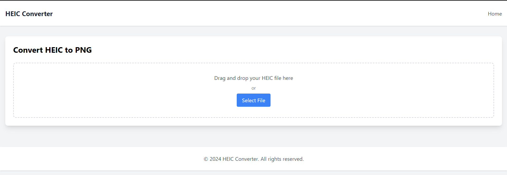
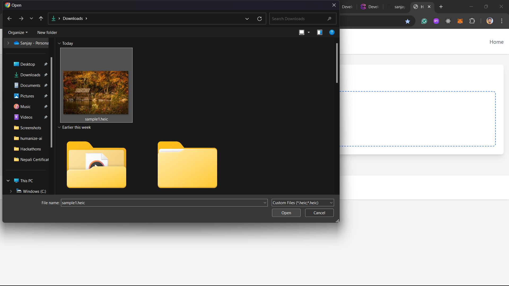
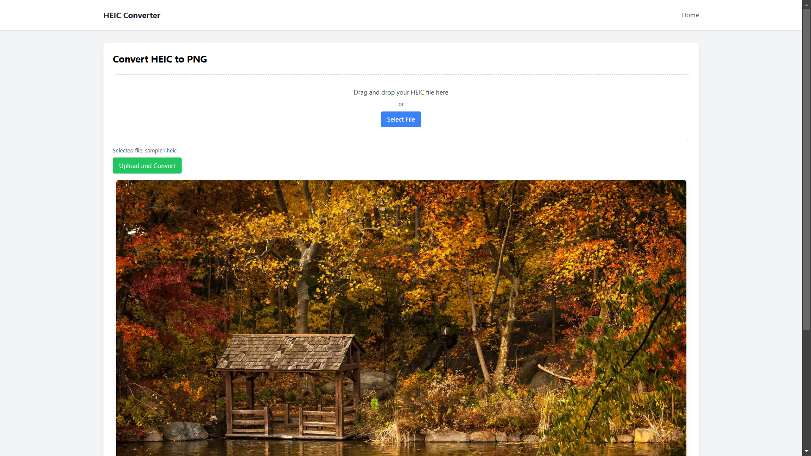
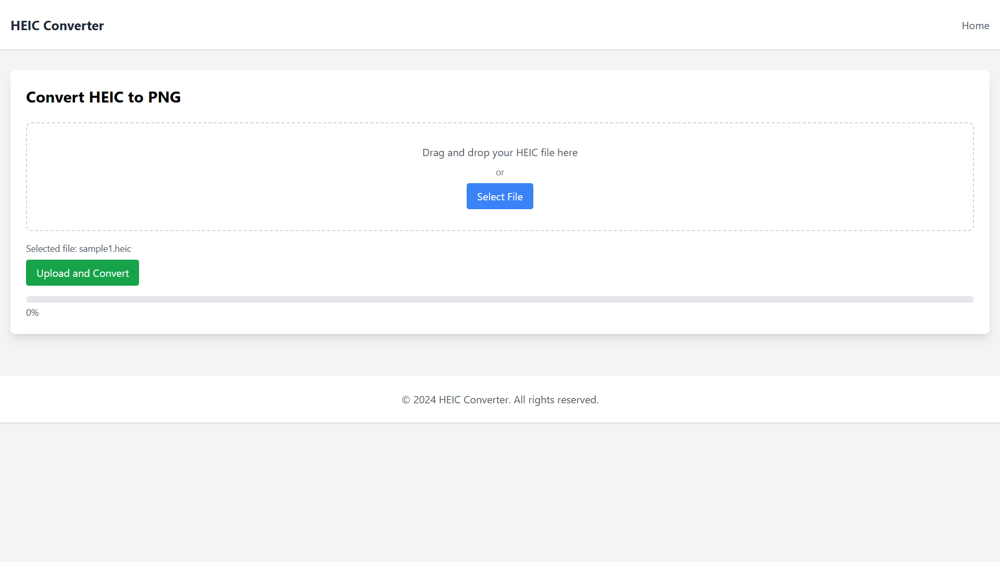

# HEIC to PNG Converter with Decentralized Storage & Compute

A decentralized application that converts HEIC images to PNG format using Acurast for computation and Cere Network for decentralized storage.

## Overview

This project demonstrates the integration of decentralized storage and compute capabilities by:

- Using Cere Network's DDC (Decentralized Data Cloud) for storing images
- Leveraging Acurast's decentralized compute network for HEIC to PNG conversion
- Providing a simple web interface for users to interact with these services

## Features

- 🗂️ Simple folder browser interface
- 📤 HEIC file upload to Cere Network DDC
- 🔄 Decentralized image conversion via Acurast
- 📥 Automatic storage of converted PNG files
- 🔗 Shareable download links for converted images
- 🔒 Secure file handling
- 🌐 Fully decentralized architecture

## Screenshots






## Technical Architecture

1. **Frontend**: Express with EJS and Tailwind CSS
2. **Storage**: Cere Network DDC
3. **Compute**: Acurast Network
4. **File Processing**: Node.js with heic-convert

## Prerequisites

- Node.js v18+
- Cere Network Developer Account
- Public bucket on Cere Network DDC
- Acurast Account for compute services

## Installation

1. Clone the repository:

```bash
git clone https://github.com/sanjaysah101/pixel-chain
```

2. Install dependencies:

```bash
pnpm i
```

3. Configure environment variables:

```bash
cp .env.example .env
```

4. Update `.env` with your credentials:

```env
CERE_BUCKET_ID=your_bucket_id
CERE_CLUSTER_ID=your_cluster_id
WALLET_CREDS=path_to_credentials
WALLET_CREDS_PASSWORD=your_password
```

5. Start the development server:

```bash
pnpm dev
```

## Usage

1. Visit the application URL
2. Click "Browse" to select a HEIC file
3. Upload the file to Cere Network DDC
4. Click "Convert" to process the image
5. Once converted, use the provided link to download or share the PNG file

## Dependencies

### Core Dependencies

- "@cere-ddc-sdk/ddc-client": "^2.13.0",
- compression: "^1.7.5",
- cors: "^2.8.5",
- dotenv: "^16.0.3",
- ejs: "^3.1.10",
- express: "^4.21.1",
- heic-convert: "^2.1.0",
- multer: "1.4.5-lts.1"

### Development Dependencies

- typescript: ^5.0.4
- @types/node: ^18.15.11
- nodemon: ^2.0.22

## API Documentation

### Endpoints

#### POST /api/upload

Uploads HEIC file to Cere Network DDC

#### POST /api/convert

Triggers conversion process via Acurast

#### GET /api/download/:fileId

Retrieves converted PNG file

## Credits

- [Cere Network DDC SDK](https://github.com/Cerebellum-Network/cere-ddc-sdk-js)
- [Acurast Image Conversion](https://github.com/Acurast/acurast-example-apps)
- [heic-convert](https://github.com/alexcorvi/heic-convert)
